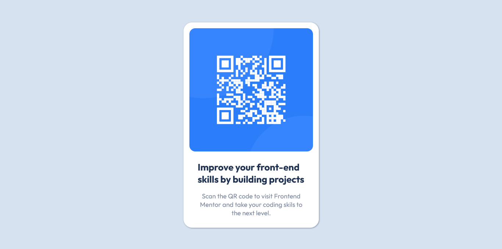

# Frontend Mentor - QR code component solution

This is a solution to the [QR code component challenge on Frontend Mentor](https://www.frontendmentor.io/challenges/qr-code-component-iux_sIO_H). Frontend Mentor challenges help you improve your coding skills by building realistic projects. 

## Overview
Built a responsive QR code landing page using vs code.

### Screenshot

## My process

Working in vs code I used the static images provided by Frontend Mentor to build a mobile first responsive card landing page.

### Built with

- Semantic HTML5 markup
- CSS custom properties
- Flexbox
- CSS Grid
- Mobile-first workflow

### What I learned

Use this section to recap over some of your major learnings while working through this project. Writing these out and providing code samples of areas you want to highlight is a great way to reinforce your own knowledge.

## Acknowledgments

I would like to thank everyone at Frontend Mentor for providing excellent mock projects to work on.
